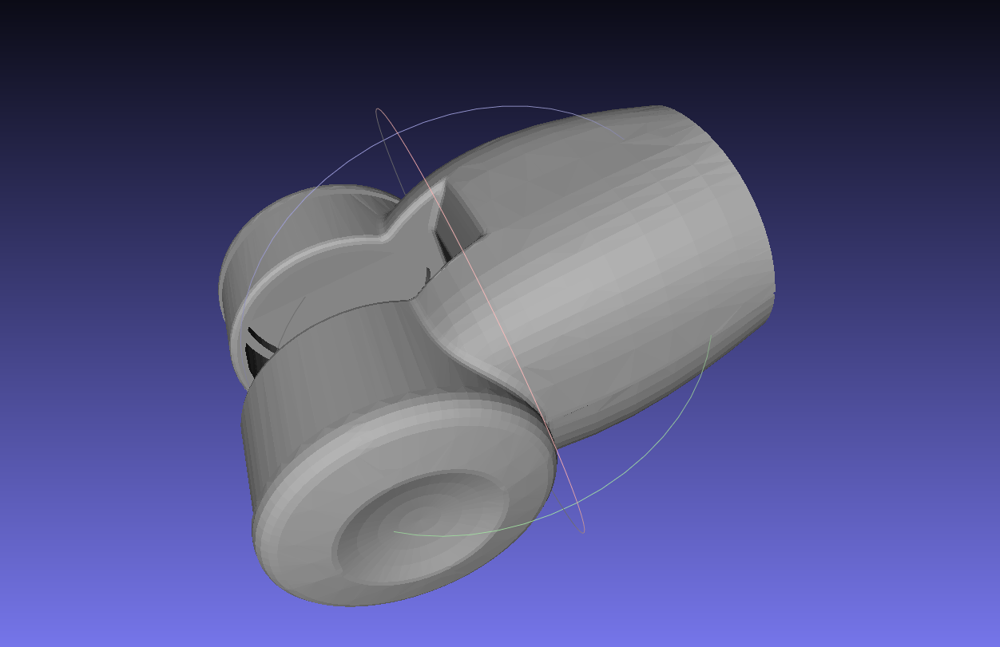
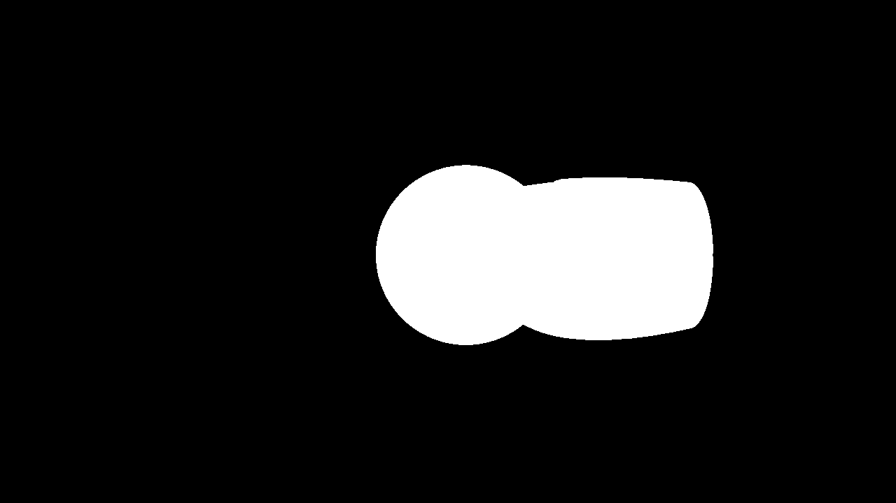

# Info

Given:
- mesh file (at the moment only .ply)
- rotation and translation values of the mesh wrt the camera frame
- camera parameters (intrinsics, width, height)

The script computes the mask of the mesh object at the provided pose. 

TODO:
- add support for stl files (commonly present in robot descriptions in ROS)

## Example:
### mesh file
   

### mask generated (for given rotation and translation values):
   

